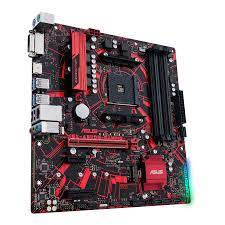
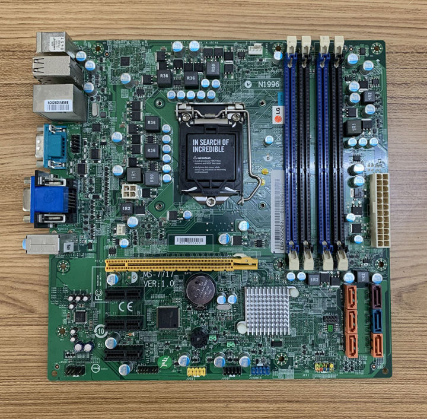

# Collaboration with GIT and implementation of a basic templeting engine with NodeJS and Express

## Objectives


1. Implementation of a templeting engine to extend our ability to write HTML with extra programmable features
2.  **GIT collaborative workflow familiarization** with the `index` and `branh` features
3.  **GIT collaborative workflow familiarization** with the concept of `Pull Requests`

## Facts that needs to keep in mind for later
1. Mark has a fork of the SimpleLoginJS project located at https://github.com/markheramis/SimpleLoginJS
2. You also have a copy of the SimpleLoginJS project located at https://github.com/e2e2a/SimpleLoginJS/

## Activities

### Branching
create a branch for the current task that we need, **note** that the task is entitled **basic templeting engine with nodejs and express** and therefore the branch name we're going to use is **templeting-engine-with-nodejs-and-express**. **note** that I replaced the spaces with (-) dashes. to create the branch, simply run the command in your project's directory
```
 git branch templeting-engine-with-nodejs-and-express
 ```
 the command above will create the branch `templeting-engine-with-nodejs-and-express` in your local git project. yoou can confirm this by running the command below
 ```
 git branch
 ```
 the command we just ran will show all the branches available to us right now. as you can see we have `master` and the `templeting-engine-with-nodejs-and-express` that we just created. and if you look even closer you will see that we are currently in the `master` branch as indecated by the (*) asterisk.

 Example

 ```
 PS C:\Users\Mark\SimpleLoginJS> git branch
   templeting-engine-with-nodejs-and-express
 * master
 ```
### Transfering to another branch
in order for us to transfer from one branch to another, we can follow the command syntax below
```
git checkout <branch name>
```

For example, to actually transfer to the branch that we recently created, we just simply:
```
git checkout templeting-engine-with-nodejs-and-express
```
To confirm that we did indeed transfer ourselves to the `templeting-engine-with-nodejs-and-express` branch the `git status` command should show the following:
```
PS C:\Users\Mark\SimpleLoginJS> git branch
* templeting-engine-with-nodejs-and-express
  master
```

You should see the (*) astirisk indicator now pointed in the `templeting-engine-with-nodejs-and-express` branch.

<br>

> **NOTE**: The conept of branching
> a branch is like a separate path where you can create and work on a new feature or fix a bug without affecting the main project. Once you're done, you can merge your branch back into the main project, combining your changes with others. It's like working on a separate copy of the project and later joining it back together with the main copy. This way, multiple people can work on different things at the same time without interfering with each other.

### Installation of the Templeting Engine

Before we begin, I put the definition of the Templeting Engine down below this document (kindly scroll down if you are curios), now what that out of the way, let's begin by installing the templeting engine to our project by running the command

```
npm install ejs --save
```

The command above will update your `package.json` and `package-lock.json` by adding the ejs package information in there.

> If you are curious about `npm install` command, you can [click me](https://docs.npmjs.com/cli/v8/commands/npm-install) to see the documentation.
> 
> NOTE: its not necessary that you read and understand everything, just look around really quick and get back to this task. 

Now that we have ejs added, our next step is to tell ExpressJS to use ejs as our templeting engine.

by replacing

```
app.engine('html', require('ejs').renderFile);
app.set('view engine','html');
```

with

```
app.set('view engine', 'ejs');
```

Now we should have EJS activated as our main renderer.

### Next Stop: rewriting the pages

in EJS we can write a more efficient HTML markup code by avoiding writing elements that are present in many pages into components and reusing them to the other pages. we can begin by identifying the components that we currently use right now.

By inspecting both the index.html and products.html pages, we will notice that both files have the same navigation bar or navigation header

```
 <header class="header">
<nav class="nav">
	<a href="11.html" class="nav_title">Computer Parts</a>
	<ul class="nav_items">
			
			<li class="nav_item">
			<a href="/" class="nav_link">Home</a>
			<a href="/products" class="nav_link">Product</a>
			<a href="#" class="nav_link">About</a>
			<a href="#" class="nav_link">Service</a>
			</li>
	</ul>
	<button class="button" id="click_login">Login</button>
</nav>
</header>
 ```

in EJS we can write this as partials, to organize this we will create a folder inside view called partials (`views/partials`)

and inside there we shall create the `navigation.ejs` (`views/partials/navigation.ejs`)

inside the `navigation.ejs` we write

```
 <header class="header">
<nav class="nav">
	<a href="11.html" class="nav_title">Computer Parts</a>
	<ul class="nav_items">
			<li class="nav_item">
			<a href="/" class="nav_link">Home</a>
			<a href="/products" class="nav_link">Product</a>
			<a href="#" class="nav_link">About</a>
			<a href="#" class="nav_link">Service</a>
			</li>
	</ul>
	<button class="button" id="click_login">Login</button>
</nav>
</header>
```

Next is we rename the file `index.html` to `index.ejs` and `products.html` to `products.ejs`

then we replace the navigation code

```
<header class="header">
<nav class="nav">
	<a href="11.html" class="nav_title">Computer Parts</a>
	<ul class="nav_items">
			<li class="nav_item">
			<a href="/" class="nav_link">Home</a>
			<a href="/products" class="nav_link">Product</a>
			<a href="#" class="nav_link">About</a>
			<a href="#" class="nav_link">Service</a>
			</li>
	</ul>
	<button class="button" id="click_login">Login</button>
</nav>
</header>
```
from both files to

```
<%- include('partials/navigation'); %>
```

This way, the more pages we add, the less code we write since we will just be re-using the `partials/navigation.ejs` files over and over again.
it makes sense since the navigation will stay the same accross pages.


> In order for you to see this action
> take a look at this website https://subtleasiantreats.com/
> you will notice that despite clicking to multiple pages accross this website,
> you will notice the the header (the content above the page) will stay the same
> this is the concept of re-using components.

The resulting code should look like this

index.ejs

```
<!DOCTYPE html>
<html>

<head>
    <meta charset="UTF-8" />
    <meta http-equiv="X-UA-Compatible" content="IE=edge" />
    <meta name="viewport" content="width=device-width, initial-scale=1.0">
    <title> My first website </title>
    <link rel="stylesheet" href="public/style.css" />
    <link rel="stylesheet" href="public/Loginform.css" />
    <link href="https://fonts.googleapis.com/css?family=Poppins" rel="stylesheet">
    <script src="https://kit.fontawesome.com/49164bce3f.js" crossorigin="anonymous"></script>
</head>

<body>
    <%- include('partials/navigation'); %>
    <!-- PICTURE BACKGROUND -->
    <section class="homepage" id="images">
        <!-- CLASS CONTAINER FOR LOGIN FORM -->
        <div class="form_container" action="index.html" id="form">
            <!-- XMARK CLOSE ICON -->
            <i class="fa-solid fa-xmark xmark_CLOSE"></i>
            <!-- LOGIN FORM -->
            <div class="form login_form" onsubmit="return validate()" method="post">
                <form action="login">
                    <h1>Login</h1>
                    <!-- USERNAME -->
                    <div class="box1">
                        <input type="username" placeholder="Username" name="Username" id="username" required>
                        <i class="fa-solid fa-user user"></i>
                    </div>
                    <!-- PASSWORD -->
                    <div class="box1">
                        <input type="password" placeholder="Password" name="Username" id="password" required>
                        <i class="fa-solid fa-lock psw"></i>

                    </div>
                    <!-- CHECKBOX REMEMBER ME -->
                    <div class="check_remember">
                        <span class="checkbox">
                            <input type="checkbox" id="check">
                            <label for="check"> Remember me</label>
                        </span>
                    </div>
                    <!-- button 2 Login -->
                    <button type="submit" class="button2" id="button2" onclick="login()">Login Now </button>
                    <!-- SIGNUP -->
                    <div class="clickcreate">
                        Don't have an account? <a href="#" type="signUup" id="signup">SignUp</a>
                    </div>
                </form>
            </div>
            <!-- SIGNUP FORM -->
            <div class="form signup_form" name="form" method="post" onsubmit="return myFunction()">
                <form action="register">
                    <h1>Signup</h1>
                    <!-- USERNAME -->
                    <div class="box1">
                        <input type="username" placeholder="Username" name="UsernameC" id="username" required>
                        <i class="fa-solid fa-user user"></i>
                    </div>
                    <!-- PASSWORD -->
                    <div class="box1">
                        <input type="password" placeholder="Password" name="passwordC" id="password" required>
                        <i class="fa-solid fa-lock psw"></i>
                    </div>
                    <!-- PASSWORD -->
                    <div class="box1">
                        <input type="password" placeholder="Confirm Password" name="Cpassword" id="password"
                            required>
                        <i class="fa-solid fa-lock psw"></i>
                    </div>
                    <!-- CHECKBOX REMEMBER ME -->

                    <!-- button 2 Login -->
                    <button class="button3" id="button3" onclick="create()">Signup Now</button>

                    <!-- SIGNUP -->
                    <div class="clicklogin">
                        Don't have an account? <a href="#" type="login" id="login">Login</a>
                    </div>
                </form>
            </div>
        </div>
    </section>
</body>
<script src="public/Form.js"></script>

</html>
```

products.ejs

```
<html>

<head>
    <meta charset="UTF-8" />
    <meta http-equiv="X-UA-Compatible" content="IE=edge" />
    <meta name="viewport" content="width=device-width, initial-scale=1.0">
    <title>Products </title>
    <link rel="stylesheet" href="public/productstyle.css" />
    <link href="https://fonts.googleapis.com/css?family=Poppins" rel="stylesheet">
    <script src="https://kit.fontawesome.com/49164bce3f.js" crossorigin="anonymous"></script>
</head>

<body>
    <%- include('../partials/navigation'); %>
    <section class="background">
        
        <div class="heading">
            <h1>" Everything starts with a great product "</h1>
        </div>
    </section>
    <section class="product-item">
        <ul class="image">
            <li class="products"></li>
            <li class="products"></li>
            <li class="products"></li>
            <li class="products"></li>
            <li class="products"></li>
            <li class="products"></li>
            <li class="products"></li>
            <li class="products"></li>
            <li class="products"></li>
            <li class="products"></li>
            <li class="products"></li>
            <li class="products"></li>
            <li class="products"></li>
            <li class="products"></li>
            <li class="products"></li>
        </ul>
        <div class="popup-image">
            <span>&times;</span>
            
        </div>
    </section>
</body>
<script>
    document.querySelectorAll('.product-item img').forEach(image => {
        image.onclick = () => {
            document.querySelector('.popup-image').style.display = 'block';
            document.querySelector('.popup-image img').src = image.getAttribute('src');
        }
    });
    document.querySelector('.popup-image span').onclick = () => {
        document.querySelector('.popup-image').style.display = 'none';
    }
</script>

</html>
```

### COMMITTING THE CHANGES

finally, we're done with creating our changes, its time to finally commit our changes to the repository.

First by checking what changes we did

```
git status
```

it should show that we have changes some files

let's begin by adding those changes to the index

```
git add index.js
```
and
```
git add views/index.html
git add views/index.ejs
git add views/products.html
git add views/products.ejs
git add views/partials
```
or just

```
git add views
```
and then lastly
```
git add package-lock.json
git add package.json
```

now that we've added all our changes its time to commit

```
git commit -m "<your message>"
```

Example:
```
git commit -m "installed EJS templeting engine, updated index and products page to ejs, move navigation partials to view/partials/nagivation.ejs"
```

### Pushing the branch to the Repository

since we are in a custom branch (not master) the way we push this branch to the Github Repository follows the syntax below

```
git push origin <your branch>
```
in our case since the branch is named `templeting-engine-with-nodejs-and-express`

we can push the branch with this command

```
git push origin templeting-engine-with-nodejs-and-express
```

### Congratulations  You Just Finished this task

After this task you should have the basic understanding of GIT Operations (and a little bit of Express) as well.
Review your code and this document and if you have questions, feel free to ask me anything.

Also keep in mind that you can ask me anything specifically if there's a piece of code that you are curious about and want to understand, I will happily explain or you also have the option to goolge the specific code, by doing so, you should eventually stumble upon the code documentation.
for example googling `app.post express` should show you documentation regarding the `post` method of express. Give it a try! it works with any other code!


## What is a Templeting Engine
Express.js is a fast, unopinionated, and minimalist web framework for Node.js. It allows developers to build web applications and APIs quickly. One of its features is the ability to use templating engines to create dynamic HTML content on the server-side.

A templating engine in Express.js helps to generate HTML by mixing a template file with data. Here are the main points regarding templating engines in Express.js:

- Dynamic Content Generation: Templating engines help in creating dynamic HTML content by embedding variables and expressions directly within the HTML template. When rendered, these variables and expressions get replaced by actual values.

- Separation of Concerns: They promote a clean separation of concerns by keeping the HTML structure separate from the JavaScript logic, making the codebase easier to maintain.

- Popular Templating Engines: There are several popular templating engines compatible with Express.js, such as EJS, Pug (formerly Jade), and Handlebars.

- Ease of Use: These templating engines provide a simple syntax and various features that make it easier to generate complex HTML dynamically.

- Server-side Rendering: Templating engines support server-side rendering, which means the HTML content is generated on the server and sent to the client as a complete page.

- Integration: Integrating a templating engine with Express.js is straightforward. Once set up, you can render templates in response to client requests with ease.

In summary, a templating engine in Express.js facilitates the dynamic generation of HTML on the server-side, making it simpler and more organized to create interactive and data-driven web applications.
